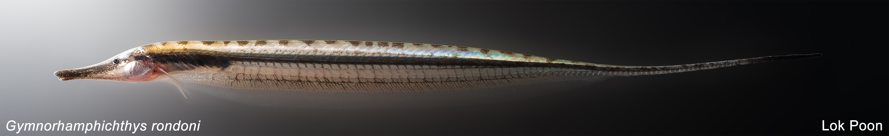
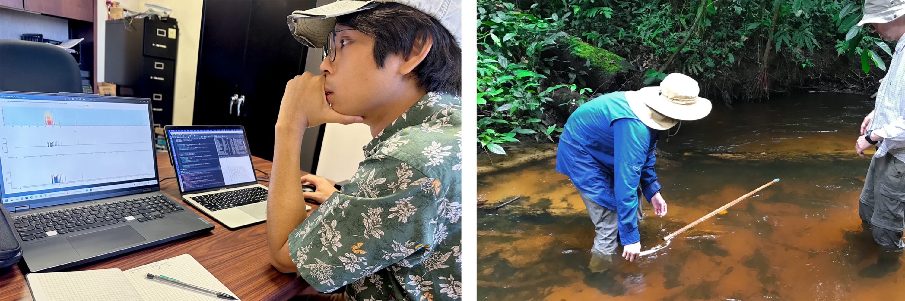

I study the sensory and behavioral ecology of predation risk, using Amazonian electric fish as a study system. I am particularly interested in how behavior is shaped by interactions between external environmental factors (e.g., moonlight, canopy cover) and internal factors (e.g., sensory capacity, body condition).

In addition, I examine sensory and behavioral interactions during predator-prey encounters, particularly in systems where signals are crucial but conspicuous and therefore require strategic deployment.

I address these questions in Amazonian electric fishes, a group that includes the electric eel and ~300 species of weakly electric knifefishes. These nocturnal fishes sense their environment predominantly through active electrolocation, detecting distortions in their self-generated electric fields. Because these unusual signals are emitted continuously, I can precisely quantify movement and foraging activity, enabling novel field observations using autonomous loggers as well as controlled laboratory experiments.

---
