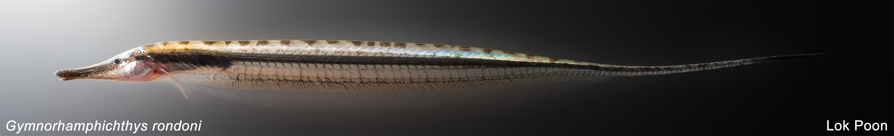
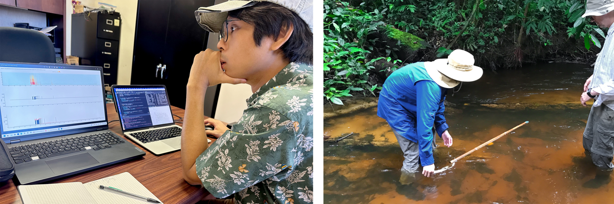

I study how animals sense and respond to predation risk, using Amazonian electric fish as a model system. My work asks how nocturnal behavior is shaped by external risk cues, such as moonlight and predator signals, and by species- and individual-level traits, such as sensory capacity, body condition, and life stage. I am especially interested in active sensing systems, where the signals animals use to detect the world can also reveal them.

 

Because electric fish continuously emit signals for navigation, foraging, and communication, their behavior can be recorded with high fidelity in natural streams and laboratory experiments. My work has shown how electric fish track moonlight, adjust foraging decisions, and use strategic silence during predator-prey encounters.

  

To support this work, I also develop tools for studying nocturnal light environments, including MoonShine, an open-source software–hardware system for predicting, recreating, and manipulating natural moonlight cycles in the laboratory.

---
