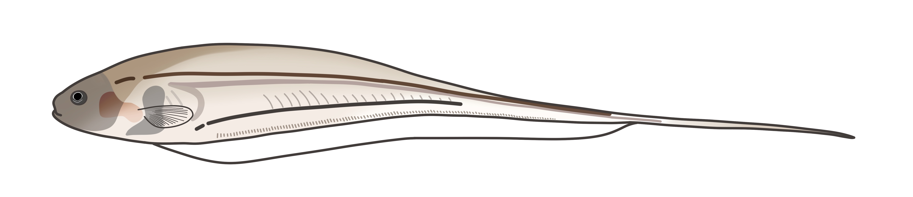

Copyright © Lok Poon 2023
# Scientific photography
{: width="800" }
{: width="800" }
{: width="600" }
{: width="600" }
# Scientific drawings

{: width="550" }
{: width="800" }
{: width="550" }
{: width="650" }
{: width="800" }
{: width="800" }
{: width="550" }
{: width="650" }
{: width="400" }
{: width="300" }
#  Other works

