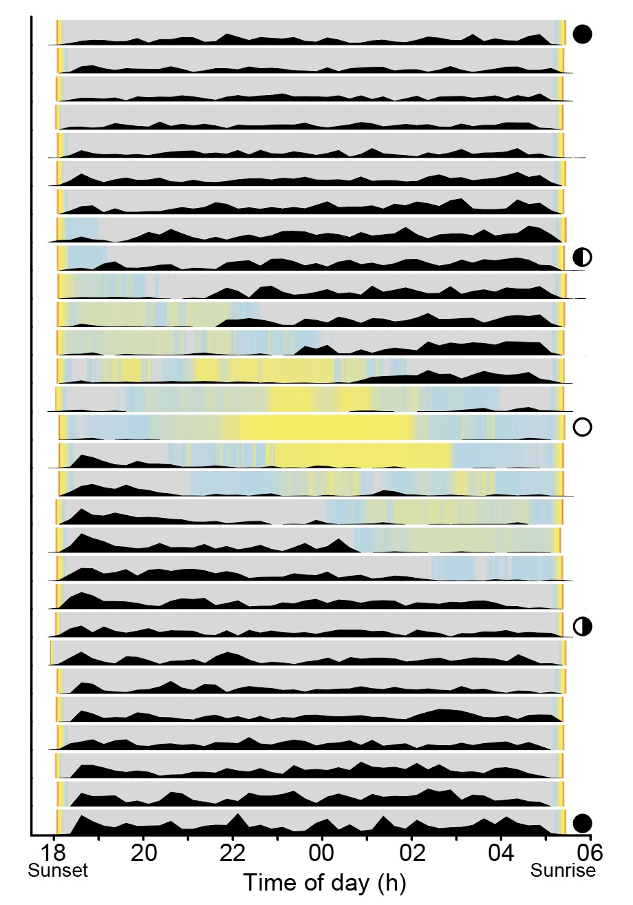
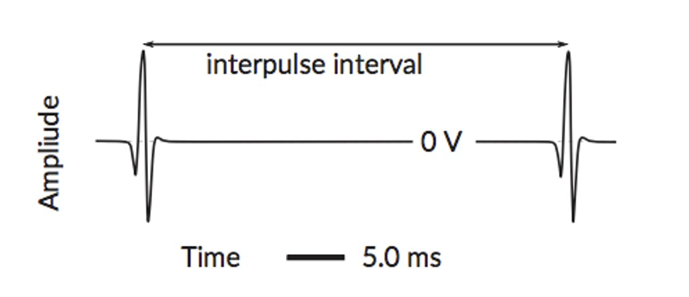
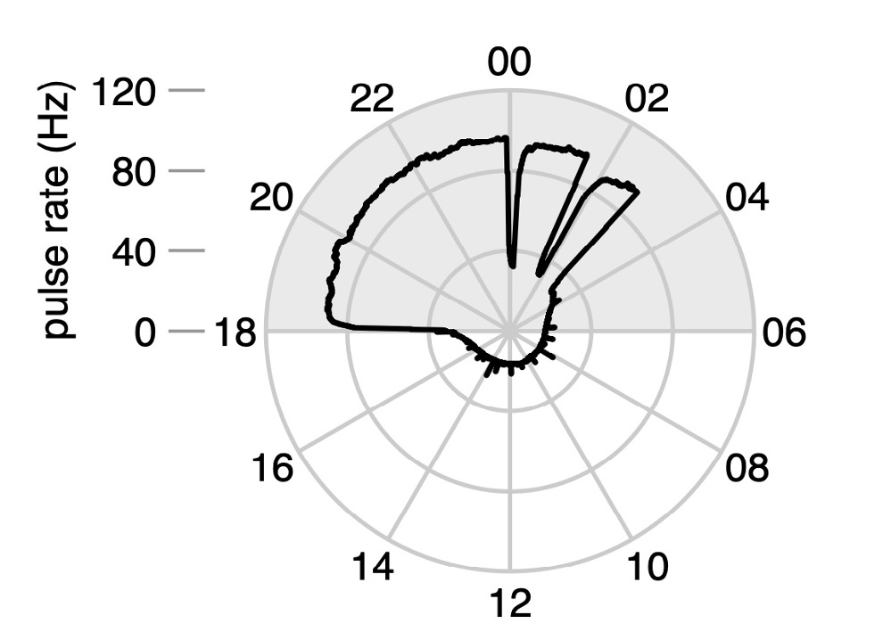
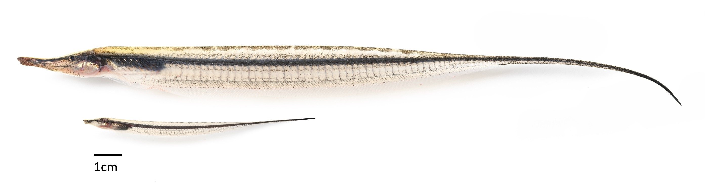
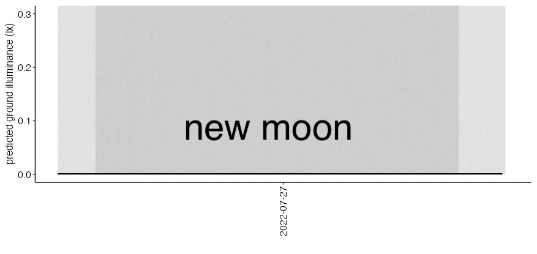

# Sensory ecology
## How vision and electric sense shape species activity patterns 
Electric fish are nocturnal and navigate and forage mainly using active electrolocation, and many species have small eyes. In shallow, clear rainforest streams, however, eye size varies strongly among species, suggesting that some species may also use vision at night when moonlight is available. Across four species, larger eyes (body mass adjusted) predicted  weaker moonlight avoidance: the largest-eyed species remained active across the lunar cycle, likely using vision to avoid predators, whereas small-eyed species reduced activity during moonlit periods. These results show how species-specific sensory traits can predict behavior and ecological effects, and they provide insight into sensory trade-offs.

{: width="500" }
#### Infrared footage of a wild sand knifefish foraging in the dark.

{: width="500" }
#### A boat-billed heron hunting visually at night.
 
## Temporal landscape of fear — Moonlight

The mere perception of predation risk can strongly influence individual behavior and drive large-scale population change. Many nocturnal species perceive moonlight as a cue of increased predation risk, but how moonlight varies over time remains poorly represented in ecological studies. I documented how lunar-phobic animals can precisely track night-to-night changes in moonrise and moonset timing across the lunar cycle.

{: width="400" }

#### Sand knifefish nighttime activity (black area) across a lunar cycle, with each row representing one night. The heatmap shows moonlight illuminance.

## Electric signal diversity
 
Electric fish constantly emit species-specific signals that enables species recognition. These signals can be continuous sinusoidal waves (wave-type) or discrete waveforms (pulse-type). In pulse-type species, discharge rate is a proxy for sensory sampling rate, allowing long-term monitoring of activity. Part of my research describes interspecific diversity in pulse rate and its diurnal variation, showing that these parameters span a wide range but also overlap strongly among species.

{: width="500" }
#### Example of a pulse-type electric signal (W. G. R. Crampton 2019).

{: width="400" }
#### Pulse rate of a knifefish over 24 hours.
   
# Behavioral ecology
## State-dependent risk taking
Foraging can be especially dangerous at certain times (e.g., the full moon), yet some individuals still take risks, overriding avoidance behavior. I investigated how body condition and life stage interact to shape risk-taking decisions.
   
{: width="800" }
#### Size comparison between an adult and a juvenile sand knifefish.

## Chronobiology

Many biological rhythms are endogenous, with circadian rhythms being the best studied. Once entrained, an endogenous rhythm can persist without external cues. Evidence for an endogenous lunar rhythm in foraging has been scarce, because it must adjust to the daily delay in moonrise and moonset; however, I found support for this possibility in experiments with sand knifefish.
   
{: width="700" }
#### Progression of nightly moonlight illuminance across a lunar cycle, simulated by MoonShineR.