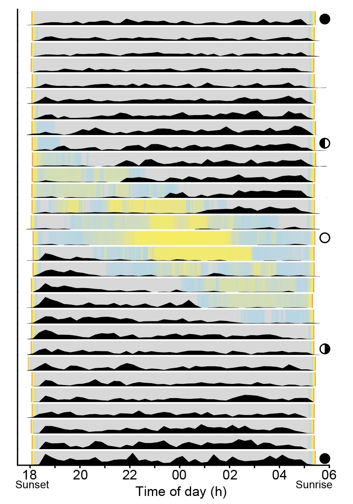
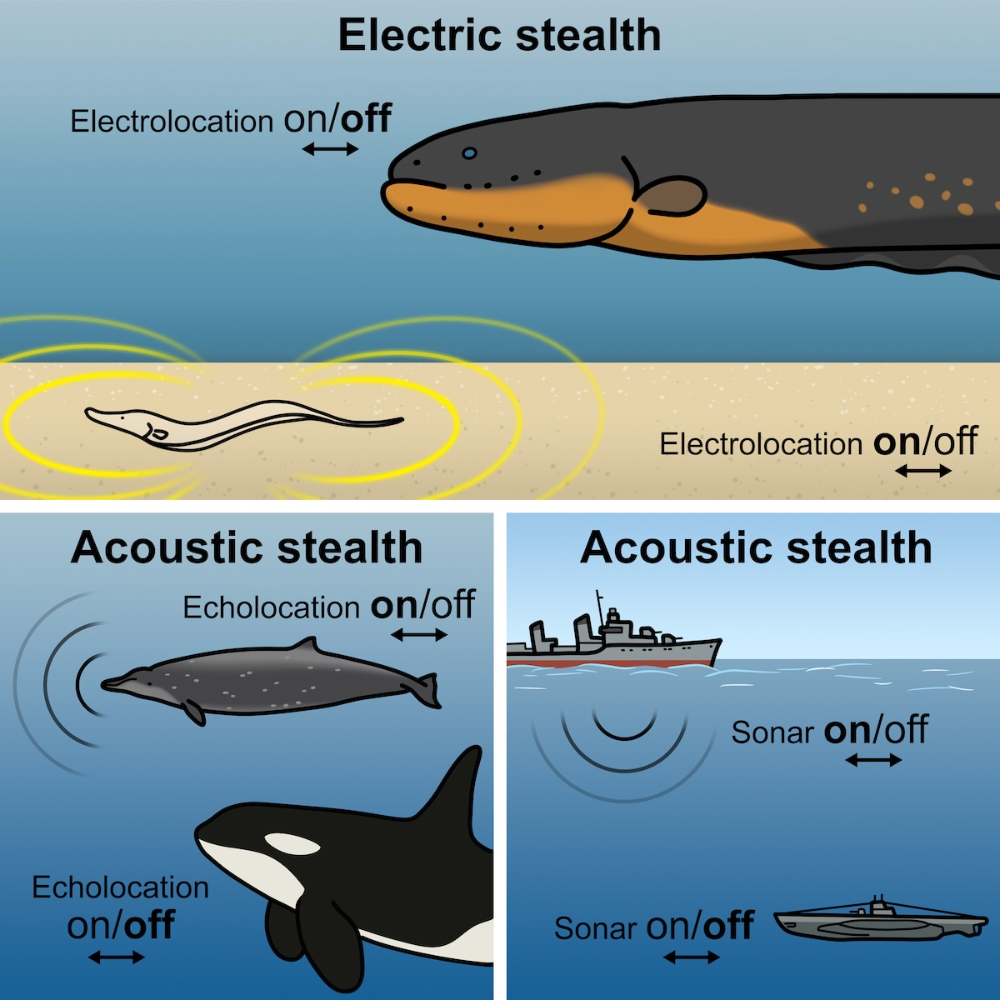
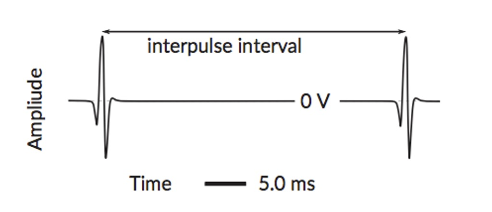
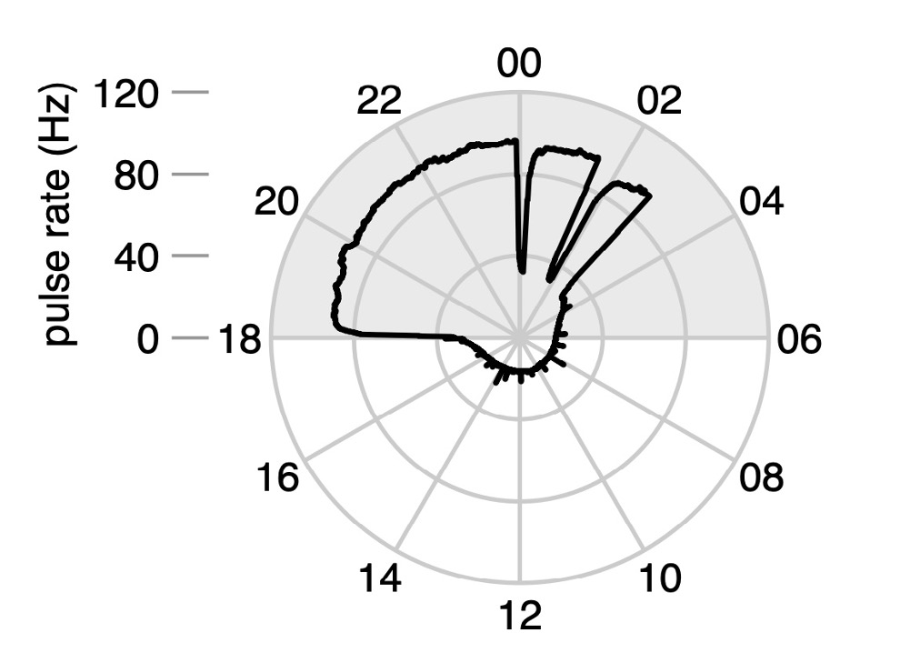
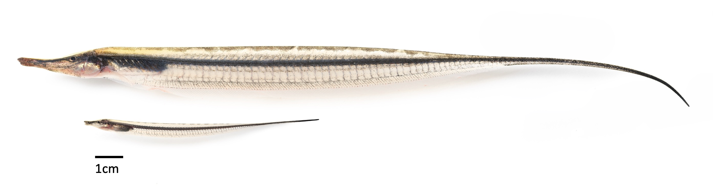
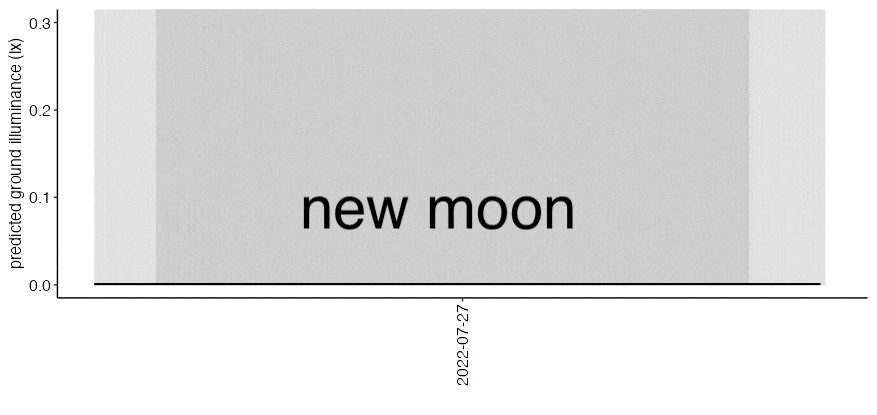

# Sensory ecology
## 1) Sensory traits shape nocturnal activity patterns

Electric fish are nocturnal and rely mainly on self-generated electrolocation signals to navigate and forage, so most species have small eyes. Yet in small rainforest streams, eye size varies among species, suggesting that some species also use vision when moonlight is available. Across four species, larger eyes predicted weaker moonlight avoidance: the largest-eyed species remained active throughout the lunar cycle, likely using vision to detect and evade predators, whereas small-eyed species reduced activity during moonlit periods. These results show how sensory traits shape nocturnal behavior and ecological interactions.

{: width="450" } 
<small><strong>Infrared footage of a wild sand knifefish foraging in the dark.<small><strong>
## 2) Moonlight as a temporal landscape of fear

The perception of predation risk, even without direct predation, can strongly shape animal behavior and population dynamics. Many nocturnal species perceive moonlight as a cue of increased risk from visually oriented predators, but ecological studies often simplify how moonlight changes across the night and lunar cycle. I showed that lunar phobic animals can closely track night-to-night shifts in moonrise and moonset.

{: width="450" } 
<small><strong>A boat-billed heron hunting visually at night.<small><strong>
 
 
{: width="400" } 
<small><strong>Sand knifefish nighttime activity across a lunar cycle. Each row represents one night; black areas show fish activity, and the heatmap shows moonlight illuminance.<small><strong>
## 3) Signaling, detection, and stealth in predator-prey interactions

For animals that use active sensing, such as echolocation and electrolocation, the signals used to sense the world can also reveal them. This trade-off is especially important in predator-prey systems where both sides share the same active sense and can intercept each other’s signals. In Amazonian streams, electric eels and knifefish both reduce this risk by briefly going electrically silent, showing how active sensing systems can shift between detection and stealth.

Coverage in [BBC Wildlife](https://www.discoverwildlife.com/animal-facts/electric-eel-signal-suppression).
 
 
{: width="450" } 
<small><strong>Graphical abstract from Poon & Crampton 2026, [Current Biology](https://doi.org/10.1016/j.cub.2026.02.026).<small><strong>
## 4) Diversity in electric signaling rate

Electric fish constantly emit species-specific signals that support navigation, foraging, and communication. In pulse-type species, unlike wave-type species, faster discharge rates reflect higher sensory sampling rates, which can improve foraging performance. I surveyed pulse rate and its daily variation across more than 20 species, comparing these traits in the context of phylogeny and ecology.

{: width="450" } 
<small><strong>Example of a pulse-type electric signal (Crampton 2019).<small><strong>
 
 
{: width="400" } 
<small><strong>EOD pulse rate of a knifefish over 24 hours. Pulse rate increases after sunset, when knifefish emerge to forage.<small><strong>
 
# Behavioral ecology
## 1) State-dependent risk taking

Foraging can be especially dangerous at certain times, such as during the full moon, yet some individuals still take risks and override avoidance behavior. Body condition and life stage are important individual-level traits that influence trade-offs among growth, reproduction, and safety. In adult sand knifefish, individuals in lower body condition increased foraging under high predation risk, but this pattern was not observed in juveniles.

{: width="600" } 
<small><strong>An adult and a juvenile sand knifefish.<small><strong>
## 2) Anticipatory behavior and endogenous rhythms

Endogenous rhythms, in which internal clocks guide the timing of activity, help animals anticipate predictable environmental changes. I found rare evidence for a monthly lunar rhythm in sand knifefish foraging. On most days, fish began preparing for nighttime emergence during the afternoon, but this anticipatory behavior was suppressed around the full moon, when moonlight would already be present at nightfall and emergence would be especially risky.

{: width="600" } 
<small><strong>Progression of nightly moonlight illuminance across a lunar cycle. Nocturnal animals must track this complex, shifting lightscape from one night to the next to optimally allocate activity.<small><strong> 
 
{: width="350" } 
<small><strong>[Biology Letters cover](https://royalsocietypublishing.org/rsbl/article/22/4/20250704/481167/Timescapes-of-fear-exogenous-and-endogenous), Volume 22, Issue 4, April 2026. Sand knifefish nighttime emergence involves an endogenous rhythm that operates around the lunar cycle.<small><strong>