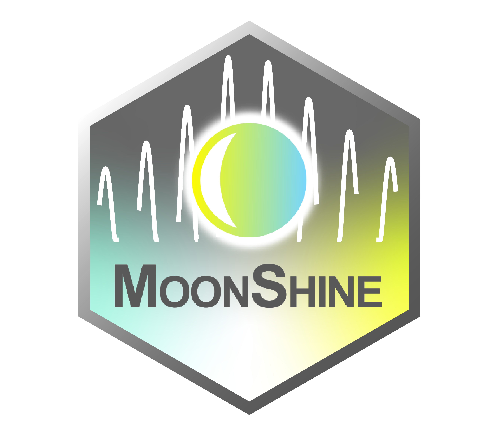
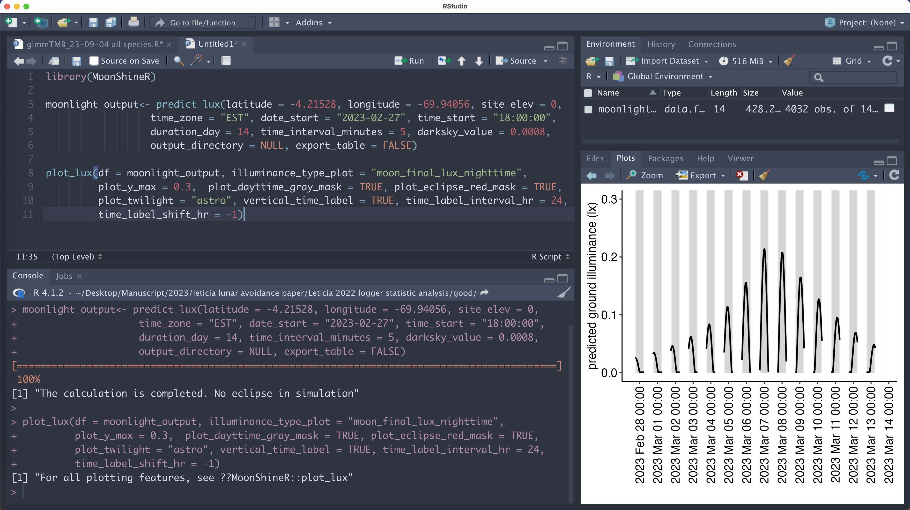
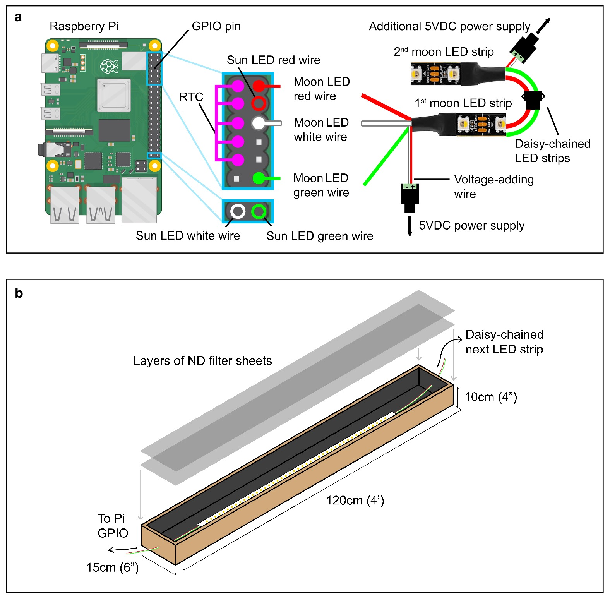

# MoonShine
{: width="250" }
- To address the lack of open-source solutions for re-creating and manipulating moonlight cycles, we developed the software-hardware system MoonShine. This has two components:

### MoonShineR
- An R package with additional R scripts, predicts moonlight ground illuminance (in lux) at defined intervals, for a specified location and time range.
{: width="1000" }
### MoonShineP
- MoonShineP, a Python program running on a Raspberry Pi computer, uses the illuminance values from MoonShineR to gradually dim and brighten a diffused array of individually addressable LEDs, allowing realistic natural light regimes to be re- created in a laboratory environment.
{: width="600" }
## Usages
- MoonShine allows researchers to re-create a range of natural nocturnal lighting scenarios in the laboratory. It can be used to re-create full natural moonlight cycles with a relatively realistic spectral composition, generate manipulated moonlight schedules, or simulate light pollution. Furthermore, the moonlight illuminance predicted by MoonShineR is useful for field ecologists who require moonlight as a quantitative model predictor. Finally, to provide laboratory-housed animals with full diurnal light cycles, MoonShine allows researchers to re-create (in a simplified manner) natural twilight and sunlight regimes.
- MoonShine includes multiple features to re-create and manipulate light cycles. It supports color-shifting of the LED light (by adjustment of RGBW intensity ratios) to approximate the spectrum of natural moonlight, and to mimic habitat-specific conditions or certain types of light pollution.

## Resources
- [MoonShine GitHub Repository](https://github.com/Crampton-Lab/MoonShine)
- [MoonShine Instruction Manual](https://lokpoon.github.io/MoonShine_manual/overview.html)
