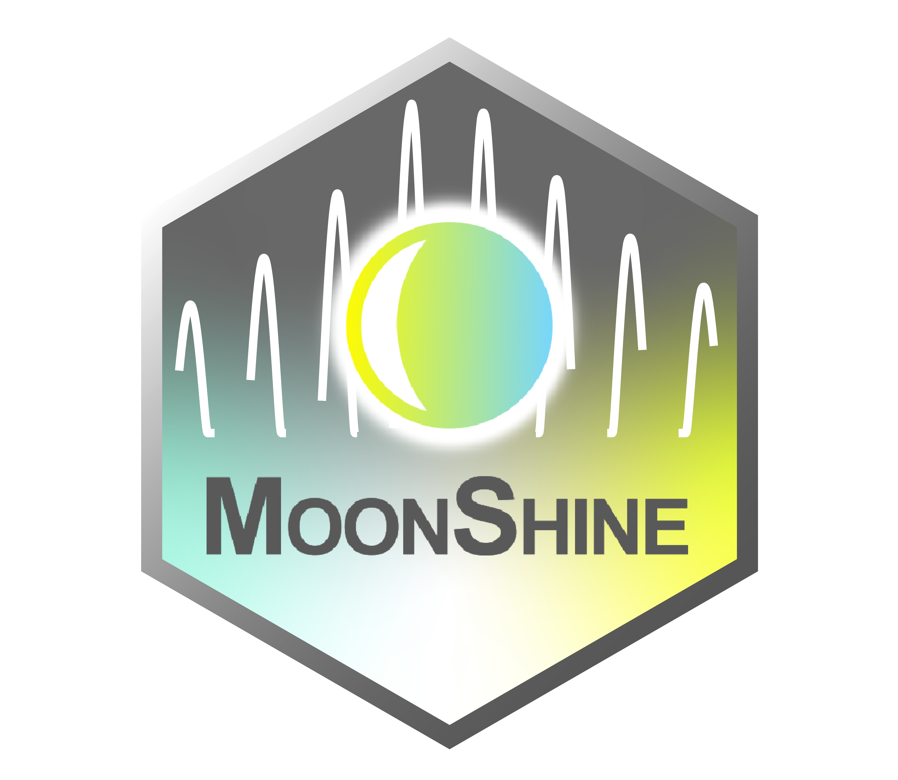
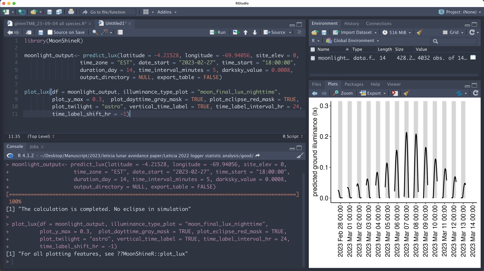
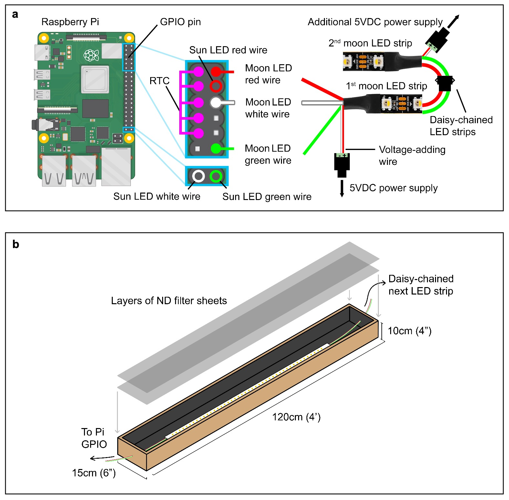

# MoonShine
{: width="300" }
   
- [MoonShine GitHub Repository](https://github.com/Crampton-Lab/MoonShine)
- [MoonShine Instruction Manual](https://lokpoon.github.io/MoonShine_manual/overview.html)
MoonShine

Moonlight varies in both intensity and timing across nights, seasons, locations, habitats, and weather conditions. Wild nocturnal animals experience this variation, but studies often simplify moonlight, using broad moon-phase categories as model predictors or reproducing moonlight in captive studies without temporal variations and validation to the intensity.  
To address the lack of open-source solutions for predicting, re-creating, and manipulating moonlight cycles, I developed MoonShine, a software–hardware system for simulating moonlight ground illuminance in the laboratory. MoonShine was designed for ecological and behavioral experiments that require realistic or experimentally modified nocturnal lighting conditions.  
MoonShine can re-create natural moonlight cycles with a relatively realistic spectral composition, generate manipulated moonlight schedules, and simulate some forms of artificial light at night. It also supports color shifting of RGBW LEDs to approximate natural moonlight, habitat-specific lighting conditions, or certain types of light pollution.

## MoonShineR
MoonShineR is an R package that predicts ground-level moonlight illuminance, in lux, at defined intervals for a specified location and time range. These predictions can be used by field ecologists as quantitative estimates of moonlight availiablity.  
MoonShineR also generates lighting schedules for laboratory experiments. In addition to moonlight, it can predict sunlight and twilight conditions, allowing researchers to create full diel light cycles when needed. It also warns users of lunar eclipses during the prediction period.
   
{: width="1000" }

#### MoonShineR pagakge demonstration. <predict_lux> function predicts ground illumiances over time. <plot_lux> function outputs a plot of the prediction.

## MoonShineP
MoonShineP is a Python program that runs on a Raspberry Pi and uses illuminance values from MoonShineR to control a diffused array of individually addressable RGBW LEDs. The LEDs gradually brighten and dim over time, allowing natural or experimentally modified light regimes to be re-created under controlled laboratory conditions.
   
{: width="600" }

## Applications
MoonShine can be used to study animal responses to moonlight, altered lunar cycles, twilight, sunlight, and artificial night lighting. It is relevant to studies of nocturnal behavior, sensory ecology, chronobiology, visual ecology, physiology, and laboratory animal care.  
Overall, MoonShine provides an open-source framework for quantifying and experimentally manipulating nocturnal light environments, rather than representing moonlight only by moon phase.